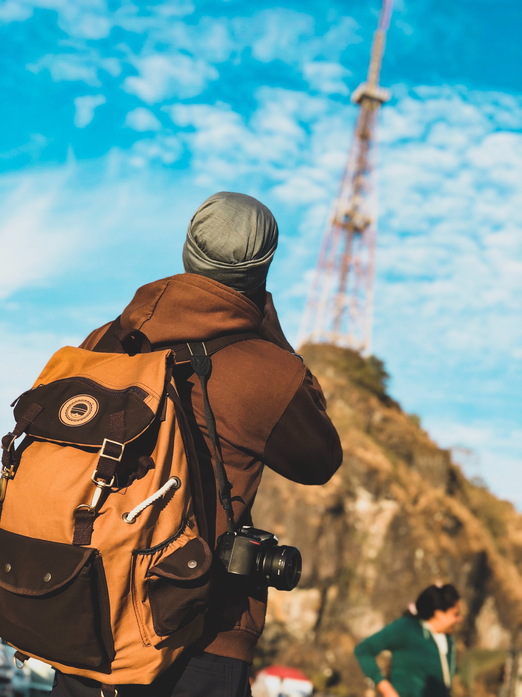

# 많은 경험의 필요성

*2022년 8월 21일*

옛날 옛적 대학 다닐 시절, 운이 좋게 미국에 웹브라우저 만드는 회사와 인턴쉽 면접을 본적이 있었다. 항상 동경해왔던 회사여서 떨리는 마음으로 스카이프를 들어갔다. 미국 본사에서 1명, 영국 지사에서 1명, 이렇게 셋이서 면접을 보게되었다. 나는 당연히 컴퓨터 관련 지식들을 많이 물어볼줄 알고 CS 공부를 열심히 하고 면접을 들어갔지만, 나의 생각과 다른 면접의 분위기였다. 그들은 나의 CV를 하나씩 꼼꼼하게 보면서, 내가 했던 과거의 경험들을 하나씩 질문하기 시작했다. 과거 경험중에서 특정 판단을 했다면, ‘왜’ 그런 판단을 했는지? 그 판단 말고 다른 선택 사항은 없었는지? 그로인한 결과를 어떻게 냈는지? 그 이후는 난 어떻게 성장했고, 다음 선택들은 어떻게 달라졌는지? 등등, **그들은 정말 ‘나’에 대해서 알고 싶어했고, 내가 어떻게 생각하는 사람인지 알고 싶다는 느낌을 받았다.** 그때 놀랐던 부분이, 나를 판단하려고 하기 보다는 일단 나에 대해서 먼저 잘 알고 싶어 했다. (이 특별했던 면접 경험은, 내가 interviewer 입장일 때, 어떤 자세로 나는 interviewee와 같이 이야기를 할지에 대한 토대가 되었다.) 그저 컴퓨터만 할줄 알았지,내가 해왔던 경험들을 곱씹어 보거나, 어떤 경험들을 갈구했는지, 어떤 생각으로 그러한 판단들을 했는지, 세상에 다양한 사람들은 어떤 생각들을 하는지 등등 폭 넓게, 그리고 깊게 사고를 해본적이 없었다.

인터뷰를 볼 때 뿐만 아니라 업무상의 미팅, 가벼운 소셜 만남등 다양한 사람들을 만날 기회가 생기고, 그들과 이야기를 하다보면 내가 경험하지 못했던 세상, 해보지 않았던 생각들, 완전히 다른 관습들을 만나게 되는데, 어릴 때의 나는(경험이 많지 않았던 나는) 이러한 다양한 세상에 대해 같이 이야기 하며 받아들일 준비가 되지 않았었다. 마치 기회를 마주하더라도 준비되지 않은 사람 처럼.

이것에 대한 인지 이후에, 어떤 경험이든, 어떤 사람이든 내가 긍정적인 감정을 느끼든, 부정적인 감정을 느낀든, **모든 만남과 경험은 나의 그릇을 넓히기 위한 ‘기회’ 라고 생각하며 오히려 ‘투자’를 했던것 같다.** 예를 들면, 어떤 모바일 서비스 운영중에, 벤더 고객중 한명이 서비스에 불만이 있었고, CTO 였던 나를 법적 고소를 한적이 있었다. 당연히 나는 이 황당한 일에 화가났지만, 마치 그릇을 넓히기 위한 투자 마인드로, ‘도대체 이 사람은 어떤 생각으로 이러한 일을 벌였는지 들어나보자’ 라는 마음으로 대면했고, 정말 생각지도 못한, 그 사람만의 사고 체계를 경험할 수 있었다. 그 이후에 나의 그릇의 깊이는 더 깊어졌던것 같고, 어떤 사람이 나의 상식과 다른 이야기들을 하더라도 나는 언제나 열린 마음으로 잘 들었던것 같다.

출장이나 여행을 가서는 항상 그 도시와 사람들의 생각, 사고방식들을 보려고 노력했다. 만나보지 못했던 도시, 나라의 사람들을 만나 그들의 이야기를 들으면 들을 수록, 나의 사고와 경험 역시 더 넓어지고, 살짝 방심하면 굳어지는 나의 사고를 계속 말랑하게 만드는것 같다. 유럽 친구중 한명은 고등학교 시절 오후 2시면 집에 돌아와서 개인 시간을 보냈지만, 그 나라의 최고 대학을 입학하고 졸업했었는데, 한국에서는 정말 상상할 수도 없는 이러한 관습, 생각들. 어떻게 그들은 학원, 야간 자율학습을 하지도 않고도 가능한가? 같은 이야기를 들으며, 생각이 점점 넓혀져 갔다.

이러한 많은 경험, 다양한 경험, 직간접적인 경험들을 통해 나의 사고 확장에 ‘투자’를 한다. 아직도 성장하고 있지만 어릴적 나와(경험이 없던 나와)의 큰 차이점이라고 하면, 이제는 더 크고 중요한 문제들을 다룰 수 있다는 것이다. 또한 더 크고 중요한 사람들과도 같이 동감하며 이야기할 수 있게 되었다는 것이다. 작고 어릴때 부터 이러한 경험을 했으면 더 좋았겠지만, 20대부터라도 깨달아서 다행이였고, 지금 자라나는 나의 아들에게는 같은 돈을 쓰더라도, 좋은 성적, 좋은 학교보다는 더 많은 사람들을 만나서 이야기하고, 더 많은 경험들을 할 수 있게 투자를 해줄것이다. **흔히 말하는 좋은 사람들, 좋은 경험만 할 필요는 없고, 힘든 경험들, 고된 경험들 조차도 너의 그릇을 키우는 ‘기회’라고 말해줄 것이다.**
